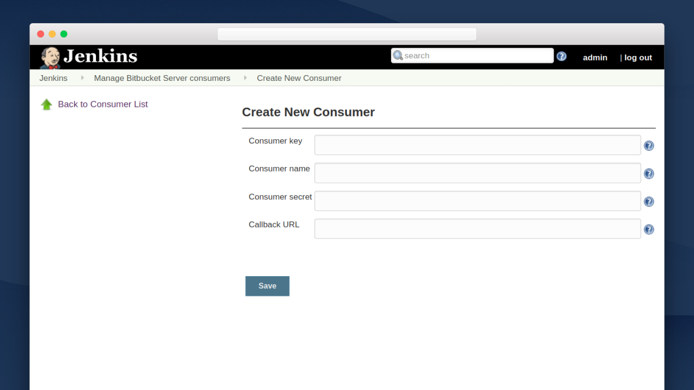
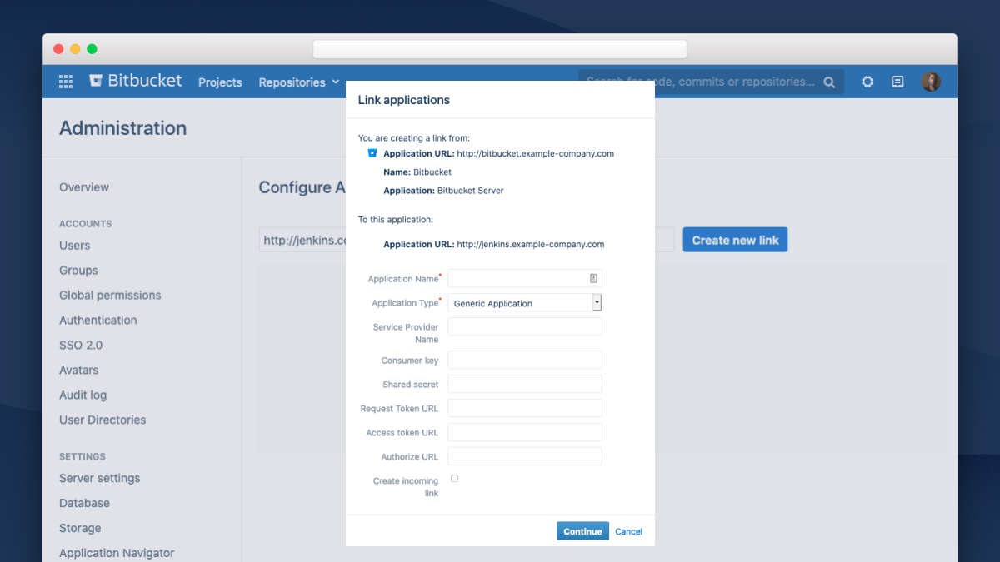

# Bitbucket Server integration
[](https://ci.jenkins.io/job/Plugins/job/atlassian-bitbucket-server-integration-plugin/job/master/)

---
We're collecting feedback at [issues.jenkins-ci.org](https://issues.jenkins-ci.org/browse/JENKINS-59578?jql=project%20%3D%20JENKINS%20AND%20component%20%3D%20atlassian-bitbucket-server-integration-plugin). Head there to see what issues have been created, or create a new issue using the component _atlassian-bitbucket-server-integration-plugin_.

---

The Bitbucket Server integration plugin is the easiest way to connect [Jenkins](http://jenkins.io/) to [Bitbucket Server](https://www.atlassian.com/software/bitbucket/enterprise/data-center). With a few simple steps you can configure it to:
- Automatically create webhooks in Bitbucket to trigger builds.
- Allow Jenkins to clone/fetch from Bitbucket to run the builds.
- Display detailed builds information in Bitbucket, such as test summaries and durations.
- Link directly from Bitbucket to the logs for each build.

The plugin streamlines the entire configuration process, and removes the need for multiple plugins to achieve the same workflow.

## Plugin features

- Support for Jenkins Pipeline, Multibranch Pipeline, and Freestyle projects.
- Secure credential management in Jenkins for cloning from Bitbucket Server.
- Adds a Bitbucket Server Source Code Manager (SCM) to Jenkins, making it easy to create a connection to a Bitbucket repository when setting up a job.
- Automatic webhook creation in a Bitbucket Server repo when a Jenkins job is saved.
- Quick selection of Bitbucket Server projects and repos for a Jenkins job through a dropdown.
- The ability to automatically send build statuses to Bitbucket Server.
- Cloning from Bitbucket Server Smart Mirrors with no need to modify the clone URL.

## Requirements

- Jenkins 2.190.1+
- Bitbucket Server 7.4+

Note: Bitbucket Server 5.6 to 7.3 are supported, but they aren't recommended as creating an Application Link with one of these versions doesn't provide any additional functionality.

---

## Configure the plugin

To configure the plugin: 
1. Add Bitbucket Server instance details.
2. Create an Application Link. 

### Add Bitbucket Server instance details

Bitbucket Server instances are added and configured at the system level. Once they’re added users can select them from the SCM when creating a Jenkins job. You must add at least one Bitbucket Server instance to Jenkins.

When adding a Bitbucket Server instance you must add at least one Bitbucket Server [personal access token](https://confluence.atlassian.com/display/BitbucketServer/personal+access+tokens). Doing this allows users to automatically set up build triggers when creating a Jenkins job. For this to work the tokens you add must have project admin permissions.

In addition, you can add Bitbucket Server credentials (in the form of username and password) to make it easier for users to set up Jenkins jobs. Users will be able to choose from these credentials to allow Jenkins to authenticate with Bitbucket Server and retrieve their projects.

Watch our [video](https://youtu.be/0-FugzVYJQU) to find out how to do this, or see below for written instructions. 

 <br/>

To add a Bitbucket Server instance:

1. In Jenkins go to **Jenkins** > **Manage Jenkins** > **Configure System**.
2. Under **Bitbucket Server plugin** click **Add a Bitbucket instance**.
3. Enter instance details.
4. Select **Save**.

### Create an Application Link 

Creating an Application Link to Jenkins enables additional functionality in Bitbucket Server. This step is only relevant if you’re on Bitbucket 7.4+. 

#### Part 1 - Register Bitbucket Server as a consumer

There are two parts to creating an Application Link. The first is done in Jenkins and involves registering Bitbucket Server as a consumer.

 <br/>

To register a consumer: 
1. In Jenkins go to **Jenkins** > **Manage Jenkins** > **Manage Bitbucket Server consumers**. 
2. Select **Register new consumer**. 
3. Enter consumer details. 
4. Select **Save**. 

After you save, you’ll be taken to a page called Application Link details. It’s a good idea to keep this page open when moving onto part 2 so you can copy the details across to Bitbucket Server. 

You can also access the Application Link details page by going to **Jenkins** > **Manage Jenkins** > **Manage Bitbucket Server consumers**, and selecting the Application Link details for the consumer. 

#### Part 2 - Create an Application Link to Jenkins

The second part is done in Bitbucket Server and involves creating an Application Link to Jenkins. Many of the details you need to do this are on the Application Link details page mentioned in step 1. 

 <br/>

To create the Application Link: 
1. In Bitbucket Server go to **Administration** > **Application Links**. 
2. Enter the application URL (see Application Link details page) and select **Create new link**. 
3. Select **Continue** on the warning message. This is not a problem. 
4. Complete the form (see Application Link details page for some fields). 
5. Select **Continue**. 

After a moment, your Jenkins instance will appear in the list of linked applications. 

---

## Use the plugin 

### Create a job

Once you’ve added a Bitbucket Server instance to Jenkins users will be able to select it when creating a job. This will make it easier for them to select the repo to be cloned. They’ll also be able to select the Bitbucket Server build trigger to automatically create a webhook.

 <br/>

To create a Jenkins job:
1. Select the **Source Code Management** tab.
2. Select **Bitbucket Server**.
3. Enter the details of the job.
4. Under **Build Trigger** select **Bitbucket Server Trigger**.
5. Add a **build step**.
6. Select **Save**.

**Note:** A Jenkinsfile is required when creating a Pipeline or Multibranch Pipeline job. Other pipeline scripting methods are not yet supported. 

#### Create a Multibranch Pipeline 

To use a different Jenkinsfile for different branches of your Bitbucket Server project, you need to create a Multibranch Pipeline and add the Jenkinsfile to the repo of each branch you want to build. Jenkins will then automatically find, manage, and execute these Pipelines.

Read more about [Multibranch Pipelines on Jenkins.io](https://jenkins.io/doc/book/pipeline/multibranch/#creating-a-multibranch-pipeline). 

---

## Contributing to the plugin

### Plugin development

This plugin uses [Apache Maven](http://maven.apache.org/) for development and releases. It also uses [Groovy](http://groovy-lang.org/) as part of the presentation layer for the plugin. To build Groovy files you need to [install the SDK](http://groovy-lang.org/download.html).

### Checkstyle

Follow the rules in `checkstyle.xml` by running checks using `mvn checkstyle:check`. We also recommend setting up a pre-commit hook to ensure you don't commit changes that violate the rules. A pre-commit hook already exists in `etc/git-hooks` and can be set up configuring the git hooks path.
```
git config core.hooksPath etc/git-hooks
```

Alternatively, you can link to the pre-commit hook directly:
```
ln -s -f ../../etc/git-hooks/pre-commit .git/hooks/pre-commit
```

### Building

To build the plugin run:
```
mvn package
```

### Running Jenkins with the plugin enabled

To run Jenkins with the plugin enabled you can spin up your Jenkins instance using `java -jar jenkins.war` in a directory that has the downloaded war-file. This enables running and testing in a real Jenkins instance.

To run Jenkins quickly during development you can also run `mvn hpi:run`. This will download and start the appropriate Jenkins version. The instance will be available on [http://localhost:8080/jenkins](http://localhost:8080/jenkins) and the logs will be in the invoking console

### Debugging

To start Jenkins (and Maven) in debug mode run:
```
mvnDebug hpi:run
```
Listening on port `8000`, it will wait for a debugger to attach before loading Jenkins and the plugin. Jenkins will then be available on [http://localhost:8080/jenkins](http://localhost:8080/jenkins) with logs in the invoking console.

You can then run Bitbucket Server using [AMPS](https://developer.atlassian.com/server/framework/atlassian-sdk/install-the-atlassian-sdk-on-a-linux-or-mac-system/) with the following command:
```
atlas-run-standalone --product bitbucket --version 6.5.0
```
This will start Bitbucket Server on [http://localhost:7990/bitbucket](http://localhost:7990/bitbucket).

### Running tests

Unit tests are run with the Surefire plugin using `mvn verify`. They can be skipped using ``-DskipTests`.

Integration tests are run under the `it` profile with the Failsafe plugin using `mvn verify -Pit`. The tests will start Bitbucket Server on [http://localhost:7990/bitbucket](http://localhost:7990/bitbucket) and stop it after they are complete.

---

## Changelog

### 2.0.0 (9 July 2020)
- Application Links between Jenkins and Bitbucket Server are now supported
- Build statuses provide test summaries, duration and log links in Bitbucket Server 7.4 and above
- Fix issues JENKINS-60274
- Fix issues JENKINS-61915 and JENKINS-61411

### 1.1.0 (28 February 2020)
- Released support for Multibranch Pipeline projects
- Fix issues JENKINS-60917 and JENKINS-60649 - Webhooks not registering before first build of a pipeline job
- Fix issues JENKINS-60956 and JENKINS-60809

### 1.0.4 (28 January 2020)
- Fix issues JENKINS-60699 and JENKINS-60642

### 1.0.3 (14 November 2019)
- Fix issue JENKINS-60116

### 1.0.2 (12 November 2019)
- Fix issues JENKINS-60128 and JENKINS-60127

### 1.0.1 (1 November 2019)
- Fix issue JENKINS-59578 - Changing server configuration does not update SCM configuration
- Migrate documentaiton from Wiki to Github

### 1.0 (25 October 2019)
- Fix issue JENKINS-59802 - problems editing Admin token
- Fix issue that Pipeline jobs did not post build status
- Be more forgiving when saving a project; saving as much as possible of the provided config
- Minor bugfixes

### 1.0-rc-1 (10 October 2019)
- First stable release candidate for the upcoming 1.0 release.
- Global Credentials and Admin token are now tracked.
- Few minor bug fixes.

### 1.0-beta-4 (8 October 2019)
- Bug fixes related to mirror cloning and pipeline.

### 1.0-beta-1 (27 Sep 2019)
- Jenkins Pipelines are now supported
- You can now clone from Bitbucket Server Smart Mirrors without modifying the clone URL

### 1.0-alpha-3 (18 Sep 2019)
- Webhooks are now created in Bitbucket Server automatically when configuring the SCM
- Bitbucket SCM storage fields have changed so will require re-creating jobs that use Bitbucket SCM
- Project and repo fields when configuring the SCM are now searchable dropdowns
- Build status is now posted to Bitbucket Server after starting and completing a build

### 1.0-alpha-2 (23 Aug 2019)
- Bugfix: Last entry in server configuration can now be removed
- Minor changes and fixes

### 1.0-alpha-1 (7 Aug 2019)
- First public release
